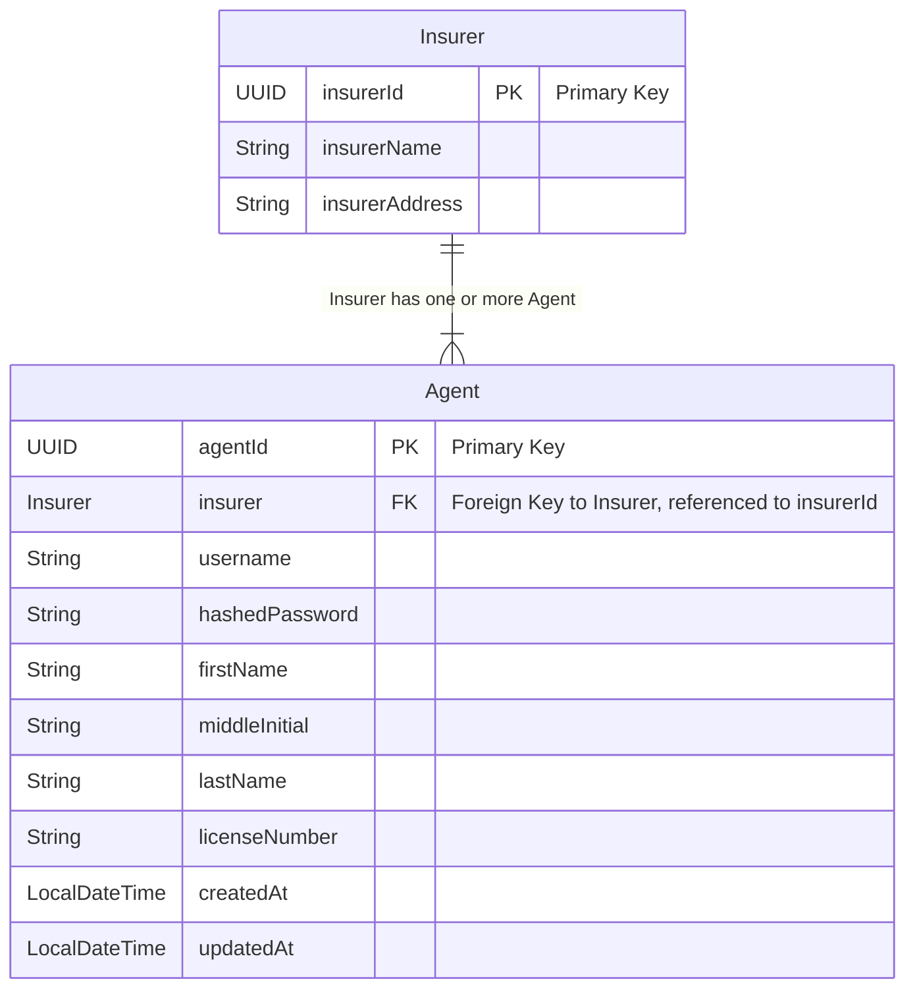
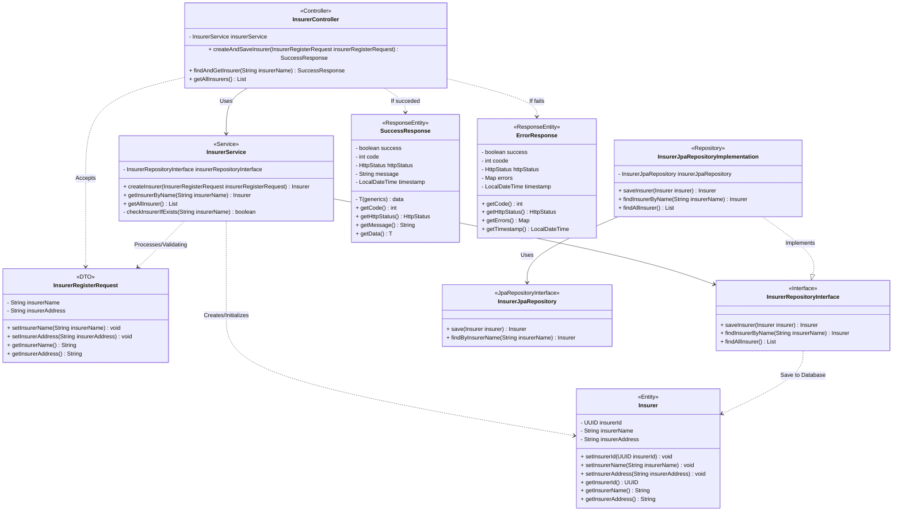
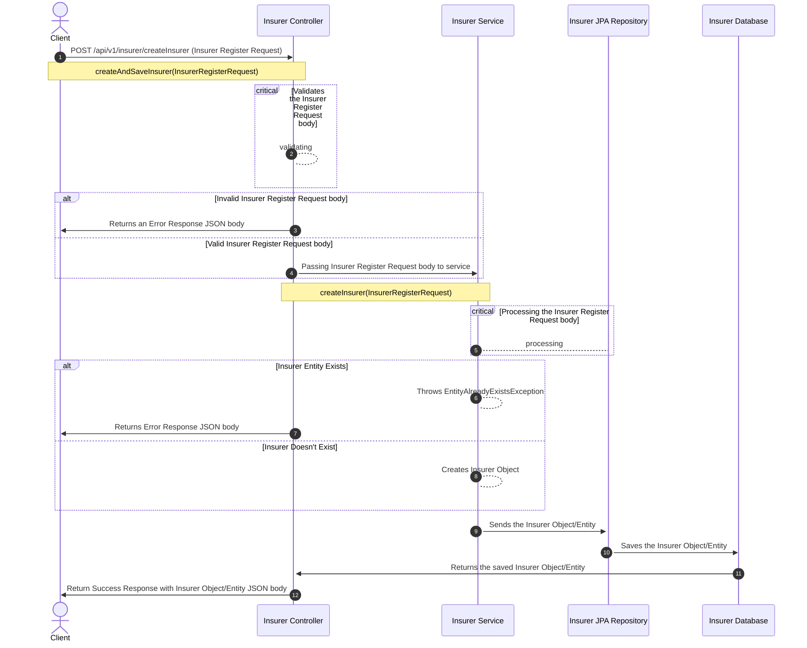

# Insurer Entity

## Entity Relationship

```mermaid
---
config
 layout:elk
---
erDiagram
 Insurer {
  UUID insurerId PK "Primary Key"
  String insurerName
  String insurerAddress
 }
 Agent {
  UUID agentId PK "Primary Key"
  Insurer insurer FK "Foreign Key to Insurer, referenced to insurerId"
  String username
  String hashedPassword
  String firstName
  String middleInitial
  String lastName
  String licenseNumber
  LocalDateTime createdAt
  LocalDateTime updatedAt
 }
 Insurer only one to one or more Agent : "Insurer has one or more Agent"
```

## Class Flow

```mermaid
classDiagram
 class InsurerRegisterRequest {
  - String insurerName
  - String insurerAddress
  + setInsurerName(String insurerName) void
  + setInsurerAddress(String insurerAddress) void
  + getInsurerName() String
  + getInsurerAddress() String
 }
 <<DTO>> InsurerRegisterRequest
 class Insurer {
  - UUID insurerId
  - String insurerName
  - String insurerAddress
  + setInsurerId(UUID insurerId) void
  + setInsurerName(String insurerName) void
  + setInsurerAddress(String insurerAddress) void
  + getInsurerId() UUID
  + getInsurerName() String
  + getInsurerAddress() String
 }
 <<Entity>> Insurer
 class InsurerRepositoryInterface {
  + saveInsurer(Insurer insurer) Insurer
  + findInsurerByName(String insurerName) Insurer
  + findAllInsurer() List<Insurer>
 }
 <<Interface>> InsurerRepositoryInterface
 class InsurerJpaRepository {
  + save(Insurer insurer) Insurer
  + findByInsurerName(String insurerName) Insurer
 }
 <<JpaRepositoryInterface>> InsurerJpaRepository
 class InsurerJpaRepositoryImplementation {
  - InsurerJpaRepository insurerJpaRepository
  + saveInsurer(Insurer insurer) Insurer
  + findInsurerByName(String insurerName) Insurer
  + findAllInsurer() List<Insurer>
 }
 <<Repository>> InsurerJpaRepositoryImplementation
 class InsurerController {
  - InsurerService insurerService
  + createAndSaveInsurer(InsurerRegisterRequest insurerRegisterRequest) SuccessResponse<Insurer>
  + findAndGetInsurer(String insurerName) SuccessResponse<Insurer>
  + getAllInsurers() List<Insurer>
 }
 <<Controller>> InsurerController
 class InsurerService {
  - InsurerRepositoryInterface insurerRepositoryInterface
  + createInsurer(InsurerRegisterRequest insurerRegisterRequest) Insurer
  + getInsurerByName(String insurerName) Insurer
  + getAllInsurer() List<Insurer
  - checkInsurerIfExists(String insurerName) boolean
 }
 <<Service>> InsurerService
 class SuccessResponse {
  - boolean success
  - int code
  - HttpStatus httpStatus
  - String message
  - T(generics) data
  - LocalDateTime timestamp
  + getCode() int
  + getHttpStatus() HttpStatus
  + getMessage() String
  + getData() T
 }
 <<ResponseEntity>> SuccessResponse
 class ErrorResponse {
  - boolean success
  - int coode
  - HttpStatus httpStatus
  - Map<String, String> errors
  - LocalDateTime timestamp
  + getCode() int
  + getHttpStatus() HttpStatus
  + getErrors() Map<String, String>
  + getTimestamp() LocalDateTime
 }
 <<ResponseEntity>> ErrorResponse
 InsurerController --> InsurerService : Uses
 InsurerController ..> InsurerRegisterRequest : Accepts
 InsurerController ..> SuccessResponse : If succeded
 InsurerController ..> ErrorResponse : If fails
 InsurerService --> InsurerRepositoryInterface : Uses
 InsurerService ..> InsurerRegisterRequest : Processes/Validating
 InsurerService ..> Insurer : Creates/Initializes
 InsurerRepositoryInterface ..> Insurer : Save to Database
 InsurerJpaRepositoryImplementation --> InsurerJpaRepository : Uses
 InsurerJpaRepositoryImplementation ..|> InsurerRepositoryInterface : Implements

```

## Workflow

### Create and save Insurer Entity

```mermaid
sequenceDiagram
 autonumber
 actor Client
 participant Insurer Controller
 participant Insurer Service
 participant Insurer JPA Repository
 participant Insurer Database
 Client ->> Insurer Controller : POST /api/v1/insurer/createInsurer (Insurer Register Request)
 Note over Client, Insurer Controller : createAndSaveInsurer(InsurerRegisterRequest)
 activate Insurer Controller
 critical Validates the Insurer Register Request body
  Insurer Controller --> Insurer Controller : validating
 end
 alt Invalid Insurer Register Request body
  Insurer Controller ->> Client : Returns an Error Response JSON body
 else Valid Insurer Register Request body
  Insurer Controller ->> Insurer Service : Passing Insurer Register Request body to service
  activate Insurer Service
 end
 Note over Insurer Controller, Insurer Service : createInsurer(InsurerRegisterRequest)
 critical Processing the Insurer Register Request body
  Insurer Service --> Insurer JPA Repository : processing
 end
 alt Insurer Entity Exists
  Insurer Service --> Insurer Service : Throws EntityAlreadyExistsException
  Insurer Controller ->> Client : Returns Error Response JSON body
 else Insurer Doesn't Exist
  Insurer Service --> Insurer Service : Creates Insurer Object
  activate Insurer JPA Repository
 end
 Insurer Service ->> Insurer JPA Repository : Sends the Insurer Object/Entity
 Insurer JPA Repository ->> Insurer Database : Saves the Insurer Object/Entity
 Insurer Database ->> Insurer Controller : Returns the saved Insurer Object/Entity
 Insurer Controller ->> Client : Return Success Response with Insurer Object/Entity JSON body
```
